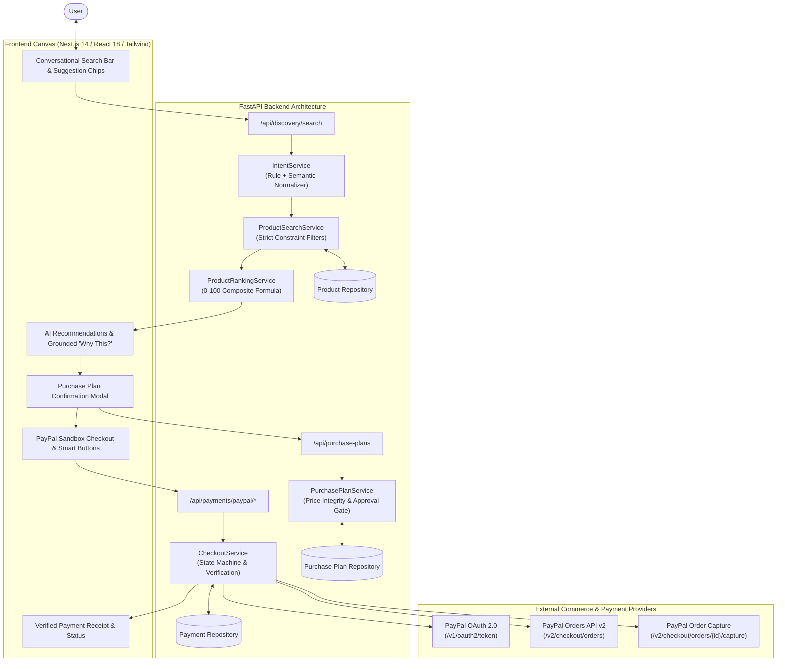
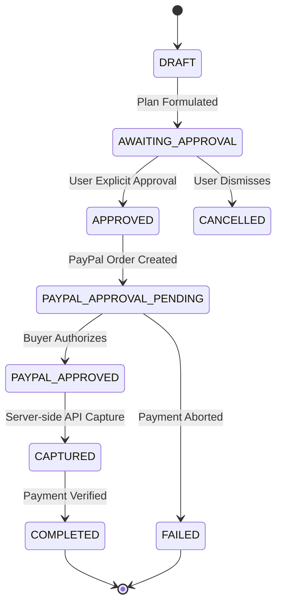

# PayPilot — System Architecture

This document outlines the system architecture, service boundaries, data flows, state machines, and security invariants for **PayPilot**, an AI-powered commerce agent developed for the PayPal AI Hackathon.

---

## 1. High-Level Architecture Overview

PayPilot connects natural-language product discovery with human-in-the-loop purchase approvals and verified PayPal Sandbox checkouts.



---

## 2. Phase 3: PayPal Sandbox Checkout Flow

The complete end-to-end purchasing pipeline follows a strict multi-step sequence:

```text
                 USER
                   │
                   ▼
              NEXT.JS UI
                   │
                   ▼
          DISCOVERY API
                   │
                   ▼
           PRODUCT SELECTED
                   │
                   ▼
          PURCHASE PLAN
                   │
                   ▼
        EXPLICIT USER APPROVAL
                   │
                   ▼
         PAYPAL ORDER SERVICE
                   │
                   ▼
            PAYPAL SANDBOX
                   │
                   ▼
             CAPTURE
                   │
                   ▼
         PAYMENT VERIFICATION
                   │
                   ▼
          SUCCESS CONFIRMATION
```

---

## 3. Payment & Purchase Plan State Machine

State transitions are strictly validated. Invalid transitions are rejected by the backend:



---

## 4. Critical Security & Integrity Invariants

1. **Backend Authoritative Pricing (No Client Price Trust)**:
   - When creating a `PurchasePlan`, the client sends only `product_id` and `quantity`.
   - The backend looks up the authoritative price directly from the verified product catalog.
   - Any price submitted by the frontend is strictly ignored.

2. **Explicit User Approval Gate**:
   - Selecting a product **never** initiates payment or order creation automatically.
   - The purchase plan requires explicit user confirmation via `POST /api/purchase-plans/{id}/approve` before a PayPal order can be initialized.
   - Calling `/api/payments/paypal/create-order` on an unapproved plan is rejected with `HTTP 400 Bad Request`.

3. **Order Ownership Verification (Mismatch Protection)**:
   - When `/api/payments/paypal/capture` is invoked, the backend verifies that `paypal_order_id` belongs strictly to the designated `purchase_plan_id`.
   - Attempting to capture with a mismatched or stolen order ID fails immediately with `HTTP 400 Bad Request`.

4. **Idempotency & Double-Capture Guard**:
   - Calling capture multiple times on an already completed order returns the existing payment record safely without triggering duplicate capture calls or double-billing.

5. **Server-Side PayPal Verification**:
   - The application never marks a purchase as paid simply because a client requests it.
   - The PayPal API response (`status == "COMPLETED"`) is the sole authoritative proof of payment.

6. **Credentials Security**:
   - `PAYPAL_CLIENT_SECRET` is kept exclusively on the backend and is never sent to the client, logged, or exposed in error messages.
