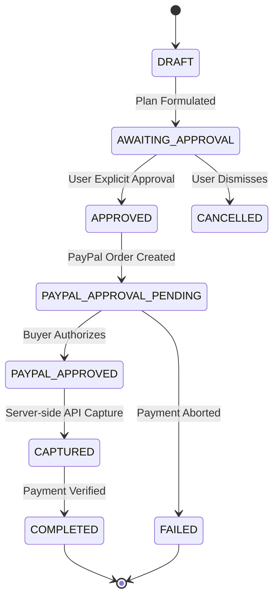
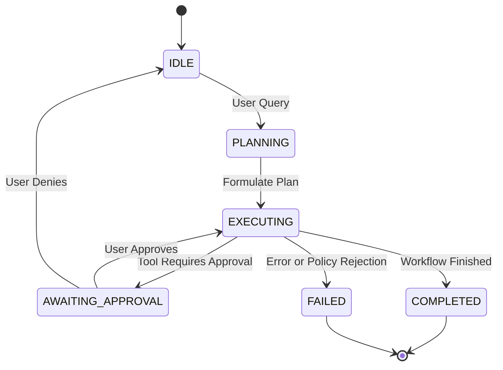

# PayPilot — System Architecture

This document outlines the system architecture, service boundaries, data flows, state machines, and security invariants for **PayPilot**, an AI-powered commerce agent developed for the PayPal AI Hackathon.

---

## 1. High-Level Architecture Overview

PayPilot connects natural-language product discovery with human-in-the-loop purchase approvals and verified PayPal Sandbox checkouts.


---

## 2. Phase 3: PayPal Sandbox Checkout Flow

The complete end-to-end purchasing pipeline follows a strict multi-step sequence:

```text
                 USER
                   │
                   ▼
              NEXT.JS UI
                   │
                   ▼
          DISCOVERY API
                   │
                   ▼
           PRODUCT SELECTED
                   │
                   ▼
          PURCHASE PLAN
                   │
                   ▼
        EXPLICIT USER APPROVAL
                   │
                   ▼
         PAYPAL ORDER SERVICE
                   │
                   ▼
            PAYPAL SANDBOX
                   │
                   ▼
             CAPTURE
                   │
                   ▼
         PAYMENT VERIFICATION
                   │
                   ▼
          SUCCESS CONFIRMATION
```

---

## 3. Payment & Purchase Plan State Machine

State transitions are strictly validated. Invalid transitions are rejected by the backend:



---

## 4. Critical Security & Integrity Invariants

1. **Backend Authoritative Pricing (No Client Price Trust)**:
   - When creating a `PurchasePlan`, the client sends only `product_id` and `quantity`.
   - The backend looks up the authoritative price directly from the verified product catalog.
   - Any price submitted by the frontend is strictly ignored.

2. **Explicit User Approval Gate**:
   - Selecting a product **never** initiates payment or order creation automatically.
   - The purchase plan requires explicit user confirmation via `POST /api/purchase-plans/{id}/approve` before a PayPal order can be initialized.
   - Calling `/api/payments/paypal/create-order` on an unapproved plan is rejected with `HTTP 400 Bad Request`.

3. **Order Ownership Verification (Mismatch Protection)**:
   - When `/api/payments/paypal/capture` is invoked, the backend verifies that `paypal_order_id` belongs strictly to the designated `purchase_plan_id`.
   - Attempting to capture with a mismatched or stolen order ID fails immediately with `HTTP 400 Bad Request`.

4. **Idempotency & Double-Capture Guard**:
   - Calling capture multiple times on an already completed order returns the existing payment record safely without triggering duplicate capture calls or double-billing.

5. **Server-Side PayPal Verification**:
   - The application never marks a purchase as paid simply because a client requests it.
   - The PayPal API response (`status == "COMPLETED"`) is the sole authoritative proof of payment.

6. **Credentials Security**:
   - `PAYPAL_CLIENT_SECRET` is kept exclusively on the backend and is never sent to the client, logged, or exposed in error messages.

---

## 5. Phase 4: Controlled Agentic Commerce Architecture

Phase 4 elevates PayPilot from discrete user-triggered endpoints into a controlled, multi-step **Agentic Commerce System**.

### 5.1 Architecture Diagram

```text
                    USER
                      │
                      ▼
             NATURAL LANGUAGE REQUEST
                      │
                      ▼
               AGENT ORCHESTRATOR
                      │
          ┌───────────┼───────────┐
          ▼           ▼           ▼
        PLAN       CONTEXT      TOOLS
          │           │           │
          └───────────┼───────────┘
                      │
                      ▼
                TOOL REGISTRY
                      │
                      ▼
                POLICY ENGINE
                      │
             ┌────────┴────────┐
             │                 │
           ALLOW           REQUIRE APPROVAL
             │                 │
             ▼                 ▼
        SEARCH / RANK     HUMAN APPROVAL
                               │
                               ▼
                          CREATE PLAN
                               │
                               ▼
                         PAYPAL SANDBOX
                               │
                               ▼
                            CAPTURE
```

### 5.2 Tool Registry & Permission Tiers

Every capability exposed to the agent loop is registered as an explicit tool with a defined permission tier:

| Tool Name | Permission Tier | Purpose | Constraints |
|:---|:---|:---|:---|
| `search_products` | `READ` | Query catalog with hard constraints | No mutations allowed |
| `get_product` | `READ` | Fetch single product specification | Read-only |
| `compare_products` | `READ` | Evaluate specs, pros/cons, metrics | Up to 4 products |
| `create_purchase_plan` | `WRITE` | Formulate authoritative purchase plan | Price derived from backend only |
| `request_purchase_approval` | `APPROVAL_REQUIRED` | Pause execution and prompt user | Pauses agent state |
| `create_paypal_order` | `PAYMENT` | Initialize PayPal Sandbox order | **Forbidden** without prior approval |
| `capture_paypal_payment` | `PAYMENT` | Verify and capture PayPal funds | Strictly requires approved order ID |

### 5.3 Policy Engine Security Boundary

The Policy Engine intercepts every tool invocation request before execution and evaluates six deterministic security invariants:

1. **Permission Check**: The tool must be registered with an authorized `ToolPermission`.
2. **Approval Enforcement**: Tools classified as `PAYMENT` or `APPROVAL_REQUIRED` are rejected immediately if `state.approval_status != 'APPROVED'`.
3. **Price Integrity**: Tool arguments cannot override or inject item price. All pricing is fetched from authoritative backend product records.
4. **Availability Verification**: Out-of-stock products cannot be formulated into purchase plans or processed for payment.
5. **Autonomy Threshold Policy**: Autonomous purchases default to `$0.00` threshold, ensuring 100% human-in-the-loop oversight.
6. **Execution Step Ceiling**: The agent loop is hard-capped at 12 steps per session to prevent infinite execution loops or resource exhaustion.

### 5.4 Agent State Machine



### 5.5 Activity Log & Telemetry

Every operational action performed by the agent produces an audit trail entry containing:
- `step_number`: Monotonically increasing turn index
- `action_type`: Tool invocation or lifecycle transition
- `tool_name`: Exact tool executed
- `status`: `executing`, `completed`, `denied`, or `failed`
- `details`: Clear operational explanation (no raw prompts or chain-of-thought)
- `timestamp`: UTC ISO 8601 timestamp

---

## 6. Phase 5: Post-Purchase Agent Architecture

Phase 5 extends PayPilot's operational lifecycle beyond the checkout confirmation, maintaining a continuous AI commerce companion for order tracking, payment verification, delay anomaly detection, and human-in-the-loop support requests.

### 6.1 Unified Commerce Lifecycle Diagram

```text
                    PAYPILOT
                       │
        ┌──────────────┴──────────────┐
        │                             │
   PRE-PURCHASE                  POST-PURCHASE
        │                             │
        ▼                             ▼
   Discovery                      Orders
   Comparison                     Tracking
   Planning                       Payment
   Approval                       Shipment
   Payment                         Issues
        │                             │
        └──────────────┬──────────────┘
                       ▼
                 AGENT ORCHESTRATOR
                       │
                       ▼
                  POLICY ENGINE
                       │
                       ▼
                ACTION / APPROVAL
```

### 6.2 Pre-Purchase vs. Post-Purchase Tool Separation

| Tool Name | Scope | Permission | Behavioral Boundary |
|:---|:---|:---|:---|
| `search_products` | Pre-Purchase | `READ` | Queries catalog within hard constraints |
| `compare_products` | Pre-Purchase | `READ` | Side-by-side trade-off matrix evaluation |
| `create_purchase_plan` | Pre-Purchase | `WRITE` | Formulates authoritative plan; price from backend |
| `create_paypal_order` | Pre-Purchase | `PAYMENT` | Requires explicit user approval |
| `capture_paypal_payment` | Pre-Purchase | `PAYMENT` | Captures funds & automatically creates order/shipment |
| `get_order` | Post-Purchase | `READ` | Enforces user isolation (`order.user_id == current_user`) |
| `get_user_orders` | Post-Purchase | `READ` | Fetches user's order history only |
| `get_payment_status` | Post-Purchase | `READ` | Verifies PayPal capture record directly from backend |
| `get_shipment_status` | Post-Purchase | `READ` | Retrieves carrier scan milestone status |
| `get_tracking_details` | Post-Purchase | `READ` | Retrieves facility timeline updates |
| `get_delivery_estimate` | Post-Purchase | `READ` | Formats authoritative delivery dates without guessing |
| `detect_order_issue` | Post-Purchase | `READ` | Deterministic anomaly detection (delays, hold status) |
| `prepare_support_request` | Post-Purchase | `WRITE` | Generates draft message only; does **not** send |
| `send_support_request` | Post-Purchase | `APPROVAL_REQUIRED` | Dispatches inquiry **strictly upon explicit user approval** |

### 6.3 Security & User Isolation Invariants

1. **Strict User Isolation**:
   - Order retrieval requires matching `order.user_id == authenticated_user_id`.
   - Access attempts to other users' orders fail with `HTTP 403 Forbidden` with zero data leakage.
2. **Deterministic Delay Detection**:
   - Mathematical date comparisons evaluate `reference_date > estimated_delivery`.
   - Carrier scan status keywords trigger `DELIVERY_DELAY` flags without probabilistic LLM hallucination.
3. **Draft vs. Dispatch Approval Gate**:
   - Preparing a support inquiry is a non-consequential `WRITE` action.
   - Dispatching to merchant support is an `APPROVAL_REQUIRED` action guarded by the Policy Engine.
4. **Order Ambiguity Resolution**:
   - When a user asks "Where is my laptop?" and owns multiple qualifying orders, the agent does **not** guess; it presents a numbered disambiguation list.

