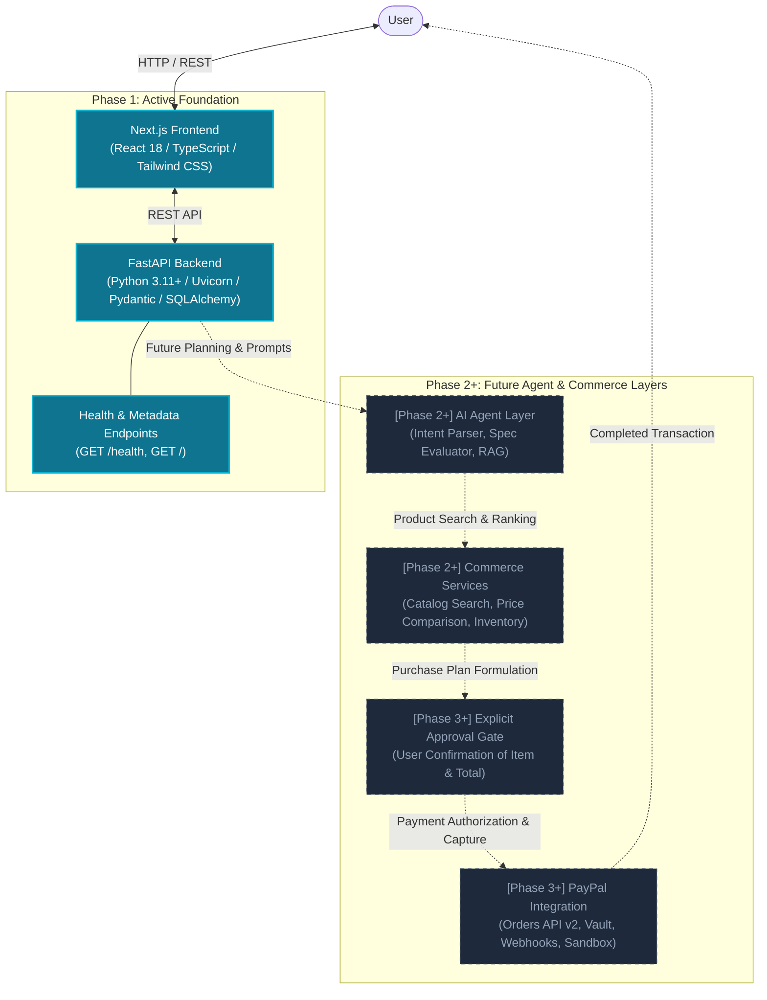

# PayPilot — System Architecture

This document outlines the high-level system architecture, service boundaries, data flows, and phased rollout strategy for **PayPilot**, an AI-powered commerce agent developed for the PayPal AI Hackathon.

---

## 1. High-Level Architecture Overview

PayPilot is designed to bridge natural language user requests with multi-vendor commerce search and PayPal-mediated checkout.

The architecture follows a modular, decoupled design:



---

## 2. Component Boundaries & Lifecycle

### Current Phase 1 Components (Implemented)

1. **Next.js Frontend (`frontend/`)**:
   - Built on Next.js 14 App Router with React and TypeScript.
   - Clean fintech/AI dark aesthetic (slate/cyan palette).
   - Serves as the landing client and future chat/interaction canvas.
   - Prepared for client-side API communication with the FastAPI backend.

2. **FastAPI Backend (`backend/`)**:
   - Python 3.11+ ASGI web service powered by Uvicorn.
   - Clean hexagonal/layered structure:
     - `app/api/`: Routing and endpoint handlers.
     - `app/core/`: Configuration management via Pydantic Settings, environment security.
     - `app/models/`: SQLAlchemy ORM database models (PostgreSQL ready).
     - `app/schemas/`: Pydantic input/output validation contracts.
     - `app/services/`: Core business logic, orchestrators, and future agent engines.
   - Provides `/health` and root `/` endpoints with automated OpenAPI docs at `/docs`.

3. **Documentation & CI/CD Hygiene (`docs/`, `.env.example`, `.gitignore`)**:
   - Strict separation of credentials; zero-secrets-committed policy.
   - Standardized Git history and semantic commit conventions.

---

### Future Components (Phase 2+)

> [!NOTE]
> The following components are explicitly marked as **Phase 2+** and are deliberately deferred in Phase 1 to guarantee a robust, verified architectural core.

1. **[Phase 2+] AI Agent Layer**:
   - **Intent Extraction**: Parsing constraints (price ceiling, performance metrics, battery life, category).
   - **Product Synthesizer**: Comparing trade-offs between matching items.
   - **Recommendation Reasoner**: Formulating transparent reasoning explanations.

2. **[Phase 2+] Commerce Services**:
   - Product catalog abstraction and search connectors.
   - Dynamic price monitoring and inventory validation.
   - Basket aggregation and shipping fee estimation.

3. **[Phase 3+] PayPal Payment Engine**:
   - Integration with PayPal REST APIs (v2/checkout/orders).
   - Explicit human-in-the-loop approval gate before executing payment transactions.
   - Order creation, authentication token exchange, and payment capture.
   - Webhook listener for asynchronous order reconciliation.

4. **[Phase 4+] Autonomous Multi-Turn Commerce**:
   - Budget guardrails and autonomous discount identification.
   - Session persistence and contextual re-prompting.

5. **[Phase 5+] Post-Purchase Agent**:
   - Order tracking and notification dispatching.
   - Returns and warranty query assistance.

---

## 3. Data Flow Comparison

### Phase 1: Operational Flow
```text
Browser Client ──(GET /health)──> FastAPI App ──(JSON Response)──> Browser Client
```

### Phase 2+ & 3: End-to-End Commerce Flow (Future Target)
```sequence
User -> Frontend: "Find laptop under $1200 for AI dev"
Frontend -> Backend: POST /api/v1/agent/query
Backend -> AI Agent: Parse Intent & Extract Constraints
AI Agent -> Commerce Service: Query matching products
Commerce Service --> AI Agent: Product candidates & spec benchmarks
AI Agent -> Backend: Recommended Top Candidate & Purchase Plan
Backend -> Frontend: Display recommendation & Purchase Confirmation Modal
User -> Frontend: Click "Approve & Pay with PayPal"
Frontend -> Backend: POST /api/v1/orders/checkout
Backend -> PayPal API: Create Order (amount, currency, item)
PayPal API --> Backend: Order ID & Approval URL
Backend --> Frontend: PayPal Smart Button / Authorization Prompt
User -> PayPal: Authorize Transaction
PayPal --> Backend: Webhook / Capture Event
Backend --> Frontend: Order Confirmed & Receipt
```

---

## 4. Security & Environment Architecture

- All configuration parameters are managed using `pydantic-settings`.
- Secrets (such as `PAYPAL_CLIENT_SECRET` or `LLM_API_KEY`) are read strictly from environment variables or a local non-committed `.env` file.
- The repository only tracks `.env.example` with sanitized placeholders.
- CORS policies in FastAPI are locked down according to the designated environment (`development` vs `production`).
