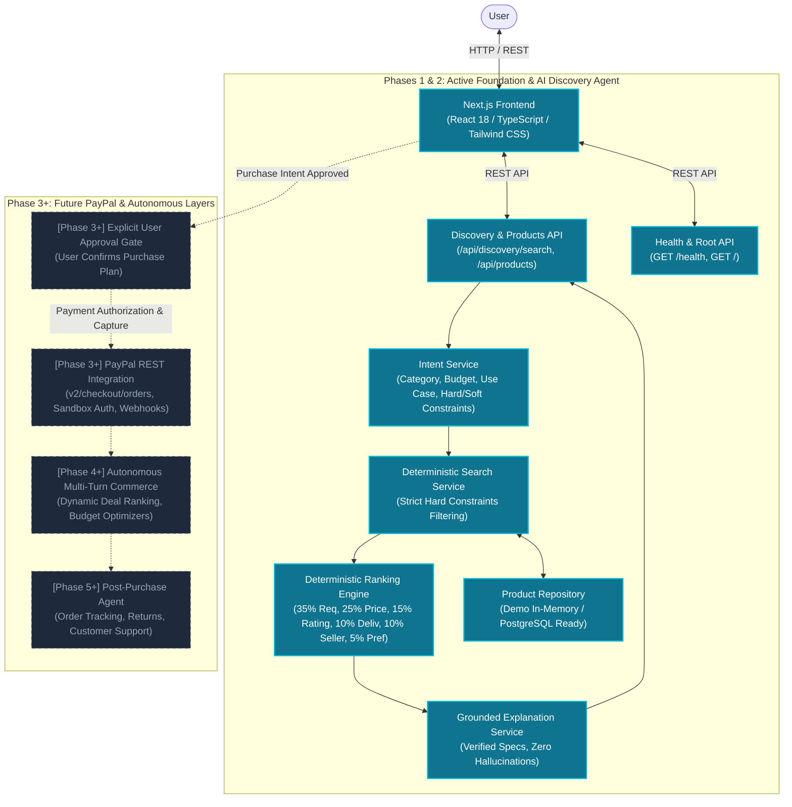

# PayPilot — System Architecture

This document outlines the system architecture, service boundaries, data flows, and phased rollout strategy for **PayPilot**, an AI-powered commerce agent developed for the PayPal AI Hackathon.

---

## 1. High-Level Architecture Overview

PayPilot bridges conversational intent with multi-vendor commerce search and PayPal-mediated checkout.

The architecture follows a modular, decoupled design with strict phase separation:



---

## 2. Phase 2: AI Product Discovery Agent Flow

The core intelligence layer implemented in Phase 2 executes as a deterministic, explainable service pipeline:

```text
                    USER
                      │
                      ▼
                 Next.js UI
                      │
                      ▼
              Discovery API (POST /api/discovery/search)
                      │
                      ▼
              Intent Service
                      │
                      ▼
            Structured Intent (ProductSearchIntent)
                      │
                      ▼
          Product Search Service
                      │
                      ▼
            Candidate Products (Enforces budget & stock invariants)
                      │
                      ▼
          Ranking Service (0-100 Mathematical Weighting)
                      │
                      ▼
             Top 3 Products
                      │
                      ▼
       Grounded Explanation Service (Verified product specs)
                      │
                      ▼
                 Frontend (3 Best Matches + Grounded Analysis)
```

---

## 3. Component Details & Safety Invariants

### 1. Intent Extraction & Normalization (`IntentService`)
- Parses natural language into strongly-typed `ProductSearchIntent` Pydantic models.
- Categorizes user constraints into **hard constraints** (category, budget ceiling, in-stock requirement) and **soft preferences** (battery life, GPU acceleration, quiet switches).
- Normalizes natural expressions (e.g., *"under one grand"* → `$1,000.00`, *"laptop below $1200"* → `$1,200.00`).
- Provides deterministic extraction guarantee with optional LLM reasoning.

### 2. Deterministic Search (`ProductSearchService`)
- Enforces non-negotiable safety rules:
  - **Rule 1**: Products with `price > max_budget` are strictly excluded.
  - **Rule 2**: Products with `stock == False` are strictly excluded.
  - **Rule 3**: Product category mismatches are excluded.
- The LLM is never allowed to override hard search constraints.

### 3. Mathematical Ranking Engine (`ProductRankingService`)
Applies a deterministic, normalized scoring formula (0.0 to 100.0):

$$\text{Score} = 0.35 \times \text{Req} + 0.25 \times \text{Price} + 0.15 \times \text{Rating} + 0.10 \times \text{Delivery} + 0.10 \times \text{Seller} + 0.05 \times \text{Pref}$$

- **Requirement Match (35%)**: Evaluates satisfaction of explicit feature thresholds (GPU, RAM, battery hours).
- **Price Fit (25%)**: Calculates optimal budget utilization.
- **Customer Rating (15%)**: Normalized score from verified customer ratings.
- **Delivery Speed (10%)**: Delivery days penalty factor.
- **Seller Reliability (10%)**: Verified merchant tier.
- **Preference Match (5%)**: Match against contextual soft preferences.

### 4. Grounded Explanation Engine (`RecommendationService`)
- Generates natural language justifications strictly from real product attributes.
- Hallucinations are structurally impossible: the engine only references validated fields (`gpu`, `ram_gb`, `battery_hours`, `price`, `rating`, `delivery_days`).

---

## 4. Phase Boundary: Future PayPal Integration (Phase 3+)

> [!IMPORTANT]
> Payment processing, PayPal REST API order creation, token capture, autonomous payment agents, and webhooks are strictly designated for **Phase 3+**.
> 
> The selection of a product in Phase 2 hands off the chosen SKU and agreed price to the upcoming Phase 3 **Purchase Plan & PayPal Sandbox Checkout** pipeline.
